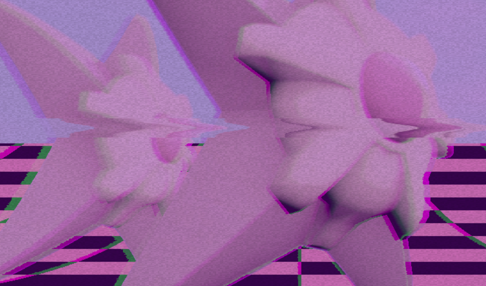
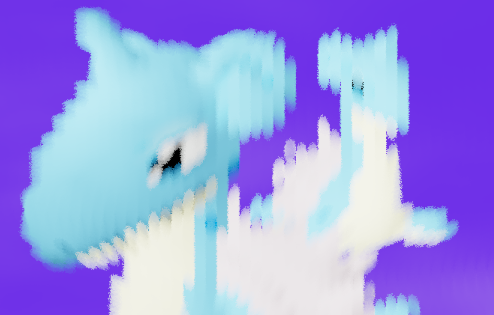

# Project 7: Deferred Renderer

## Student Info

- Name: Mauricio Mutai
- PennKey: `mmutai`

## Live Demo

Click below for the live demo!

## Techniques Used

### Deferred Rendering

- My pipeline only uses two G-buffers. The first G-buffer stores a world-space surface normal and a camera-space depth (Z coordinate) with 32-bit floating point channels. The second G-buffer stores the albedo with 8-bit channels.
- When rendering from the G-buffers, we look at the depth value to check if a given fragment is the background or not. Fragments in the background have a non-negative depth, while all rasterized points on the mesh generate a negative camera-space depth.

### Post-processing

- Once we have renderer a basic image from the G-buffers (with Lambert shading and a procedural background), we apply post-processing effects like so:
  - Apply any pre-passes (bloom)
  - Apply HDR post-process passes
  - Apply the paintbrush effect
  - Tonemap HDR to LDR
  - Apply LDR post-process passes
- Both the bloom and paintbrush effects make use of a "pre-pass", in which an additional texture is generated, but not used to directly replace the current image.
- Right now, the paintbrush effect is done on its own. This is because it uses the same pre-pass buffers as the bloom effect, so it is a bit awkward to do both pre-passes at once. My solution was to reserve the first pre-pass buffers for bloom, and if the paintbrush effect is enabled, we can use the pre-pass buffers once bloom has been applied.

### Procedural Background

- The background begins with Perlin noise, which is made to look "smoky"/smooth with FBM. This gives us a value in [0, 1].
- In the HSV color space, we determine the color of a fragment by taking a fixed hue and value for each frame (the hue changes over time), and generate a saturation value based on the smooth noise. This gives the effect of the original grayscale clouds becoming more colorful.

## Post-process Effects

### Bloom

The following shaders are executed in this order:

- `bloomHigh-frag.glsl`: Outputs only colors above a certain luminance threshold to the pre-pass buffer.
- `blurX-frag.glsl`: Performs a horizontal, 1-dimensional Gaussian blur on the pre-pass buffer.
- `blurY-frag.glsl`: Performs a vertical, 1-dimensional Gaussian blur on the pre-pass buffer.
    - Note: Currently, `blurX` and `blurY` are each executed again after this (so, two times total for each). This is done in order to exaggerate the blurring.
- `bloomAdd-frag.glsl`: Adds the pre-pass buffer and the current post-process buffer together, and outputs to the post-process buffer.

### Fake DOF

The following shaders are executed in this order:

- `dofBlurX-frag.glsl`: Performs a horizontal, 1-dimensional Gaussian blue on the post-process buffer. The intensity of the blur is determined by the difference between the camera-space depth of the fragment and a fixed focal length.
- `dofBlurY-frag.glsl`: Performs a horizontal, 1-dimensional Gaussian blue on the post-process buffer. The intensity of the blur is determined by the difference between the camera-space depth of the fragment and a fixed focal length.

### Pointilism

The following shaders are executed in this order:

- `pointilism-frag.glsl`: Applies the pointilism effect to the post-process buffer.
  - This effect is created with an imaginary grid overlaid on our buffer. Each cell of this grid should be renderered as a black circle, where the size of the circle increases the darker the original color at that point is.
  - To accomplish this, each fragment looks at a 3-by-3 square of cells surrounding itself, and colors itself as black if it determines to be inside one of the black circles generated by these cells.

### Paintbrush

The following shaders are executed in this order:

- `curl-frag.glsl`: Computes the Curl noise for each fragment, and outputs to the pre-pass buffer. 
- `paint-frag.glsl`: Applies the paintbrush effect to the post-process buffer.
  - Similar to the pointilism effect, we have an imaginary grid overlaid on our buffer. Each cell generates a "brush stroke", which is essentially a rotated ellipse. The color of this ellipse is the same color as that of the fragment at the cell's center.
  - To accomplish this, each fragment looks at an n-by-n (n > 3, if the brush strokes are too large) square of cells surrounding itself. 
  - For each cell, we check if we inside that cell's brush stroke (this uses a distance check). If we are, then we add the color of the brush stroke multiplied by a certain weight (dependent on how far we are from the cell) to an accumulated color. At the end, this accumulated color is our final output.
  - We can use noise to slightly change the distance used for each fragment in the distance check mentioned above. This gives the brush strokes a more "brushy"-like feel. This effect can be tweaked on the GUI.
  - Similarly, the frequency of the underlying noise used for the Curl noise can be changed to make the brush strokes more or less coherent (i.e. tending to face the same direction or not).
  - The scale of the brush strokes can also be tweaked with the GUI.
- As a side note, I originally tried to implement this in one pass, but it was pretty slow. Computing the Curl noise only once for each fragment, then just sampling it in a subsequent pass made it run noticeably faster.

### Vaporwave

The following shaders are executed in this order:

- `vaporwave-frag.glsl`: This operates on the post-process buffer. It desaturates the current color and blends it with purple. If the current fragment is in the background, we also generate a checkered pattern to replace part of the background.
- `vaporwaveGlitches-frag.glsl`: This operates on the post-process buffer. It applies a series of visual glitches to enhance the `A E S T H E T I C`. These include:
  - Chromatic aberration: shifting the green channel horizontally. This becomes more intense the closer you are to the left or right edges of the screen.
  - TV static: noise is added in many ways to give the effect of a glitchy, old TV.

The vaporwave effect has "interesting" effects when combined with other effects, like paintbrush. Consider this part of the `A E S T H E T I C`.

## External References

- [Stack Overflow post for handling "any type" issues in TypeScript](https://stackoverflow.com/questions/32968332/how-do-i-prevent-the-error-index-signature-of-object-type-implicitly-has-an-an). This was used to cleanly have a GUI with arbitrary string keys (more importantly, keys with whitespace in them).
- [Stack Overflow post for handling Maps in TypeScript correctly](https://stackoverflow.com/questions/34584578/typescript-es6-map-index-signature-of-object-type-implicitly-has-an-any-ty)
- [Stack Overflow post about converting to/from HSV and RGB](https://stackoverflow.com/questions/15095909/from-rgb-to-hsv-in-opengl-glsl)
- [Source for Vaporwave audio](https://www.youtube.com/watch?v=cU8HrO7XuiE)
